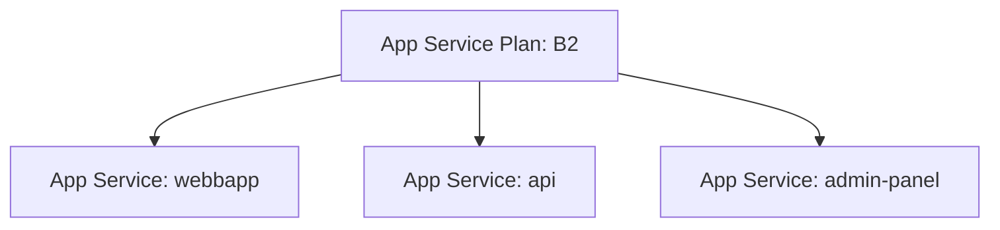
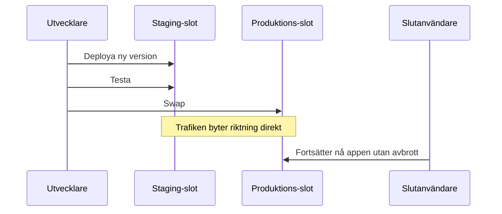

# App Service Plan och Deployment slots

> Läsmaterial för lektion 2, vecka 34. Läs efter tisdagens andra pass.

App Service och App Service Plan är två olika resurser, och att blanda ihop dem är ett av de vanligaste nybörjarmisstagen.

---

## App Service vs App Service Plan

**App Service Plan** är de underliggande beräkningsresurserna (i praktiken VM:er som Azure hanterar åt er). Det är här kostnaden faktiskt uppstår.

**App Service** är er app - webbappen eller API:et ni faktiskt skrivit. Att skapa en App Service kostar ingenting i sig, men den måste köras på en Plan.



Eftersom flera appar kan dela samma plan, kostar tre appar på en delad B2-plan exakt lika mycket som en enda app på samma plan. Det är standardsättet att hålla ner kostnader i dev- och testmiljöer.

---

## Deployment slots — noll downtime i produktion

En App Service kan ha flera **slots**: till exempel `production` och `staging`.

Flödet ser ut så här:

1. Deploya den nya versionen till `staging`
2. Testa `staging` grundligt
3. Gör en **swap** - staging blir prod, prod blir staging

```bash
az webapp deployment slot create \
  --name min-app \
  --resource-group rg-projekt-prod \
  --slot staging
```



Om något visar sig vara fel efter swappen kan ni swappa tillbaka - det tar sekunder, inte de minuter (eller timmar) en manuell rollback ofta kräver.

---

## Vad du tar med dig

Att separera Plan från App gör kostnadskontroll enklare (dela resurser i dev). Att separera staging från produktion via slots gör deployment säkrare - ni testar i en miljö som är identisk med produktion, utan att riskera att exponera en trasig version för riktiga användare.
