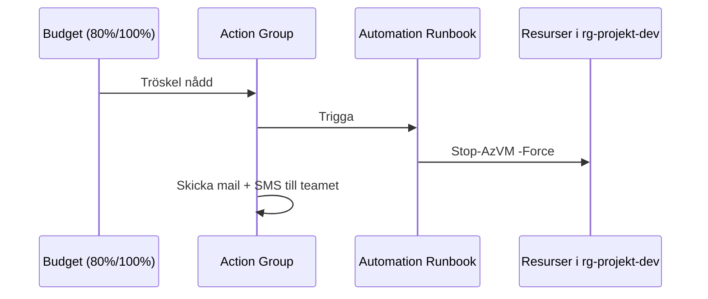

# Budget och alerts — bygg skyddsnätet

> Läsmaterial för lektion 4, vecka 33. Läs efter torsdagens första pass.

I lektion 1 hörde ni historien om 50 000 kronor på två dagar. Ingenting stoppade det automatiskt. Den här lektionen handlar om att faktiskt bygga det skyddsnät som saknades.

---

## Budget alerts — och varför de inte räcker

Azure låter er sätta upp budget-alerts: "Skicka ett mail när vi nått 80% av månadsbudgeten." Det borde alltid finnas, för alla subscriptions. Men det är bara en notifiering — **Azure stoppar ingenting automatiskt.**

**Budget alert är inte ett säkerhetsnät. Det är en påminnelse.**

Det var precis det som saknades i historien från lektion 1: en notifiering hade kommit, men ingen läste mailet i tid, och ingenting hindrade klustret från att fortsätta köra.

---

## Budget actions — det som faktiskt stoppar

För att Azure ska *agera* på en överskriden budget behöver ni koppla en **Action Group** till budgeten. En Action Group kan:

- Skicka mail och SMS
- Kalla på en **Azure Automation Runbook** som stänger ner resurser
- Trigga en **Logic App** som kör valfri logik

En enkel Runbook kan se ut så här:

```powershell
# Stäng ner alla VM:ar i en resource group
Get-AzVM -ResourceGroupName "rg-projekt-dev" | Stop-AzVM -Force
```

Det kräver setup — men ni gör det en gång och sover sedan lugnt.



---

## Budget: tre nivåer sammanfattat

| Nivå | Vad händer |
|------|-----------|
| 80% alert | Mail till er |
| 100% alert | Mail + SMS |
| Action Group | Runbook pausar/tar bort resurser |

Bara den sista nivån hade faktiskt förhindrat scenariot från lektion 1.

---

## Azure Policy — blockera dyra SKU:er i dev

Ett komplement till budget-actions är **Azure Policy** — regler som nekar, granskar eller tvingar fram viss resurskonfiguration, proaktivt, innan resursen ens skapas.

Exempel: en policy som nekar alla VM-storlekar utanför B-serien i dev. Då kan ingen råka starta en `Standard_D16s_v3` för att testa något snabbt.

```json
{
  "if": {
    "allOf": [
      { "field": "type", "equals": "Microsoft.Compute/virtualMachines" },
      { "field": "Microsoft.Compute/virtualMachines/sku.name", "notLike": "Standard_B*" }
    ]
  },
  "then": { "effect": "Deny" }
}
```

Skillnaden mot budget-actions: Policy förhindrar problemet från att uppstå överhuvudtaget. Budget-actions reagerar efter att det redan kostar pengar.

---

## Checklista: innan ni lämnar en dev-miljö

- [ ] Budget satt med alert på 80% och 100%
- [ ] Action Group kopplad till budgeten
- [ ] Azure Policy på subscription-nivå för att begränsa dyra SKU:er
- [ ] Resurser taggade med `environment=dev` — möjliggör automatisk cleanup
- [ ] Kalendernotis: ta bort miljön om den inte används efter ett visst datum

---

## Vad du tar med dig

Kombinationen budget alert + Action Group + Azure Policy är det som gör en dev-subscription trygg att använda. Ingen av delarna räcker ensam — alert utan action är bara en påminnelse, och Policy skyddar inte mot sådant den inte har regler för.
