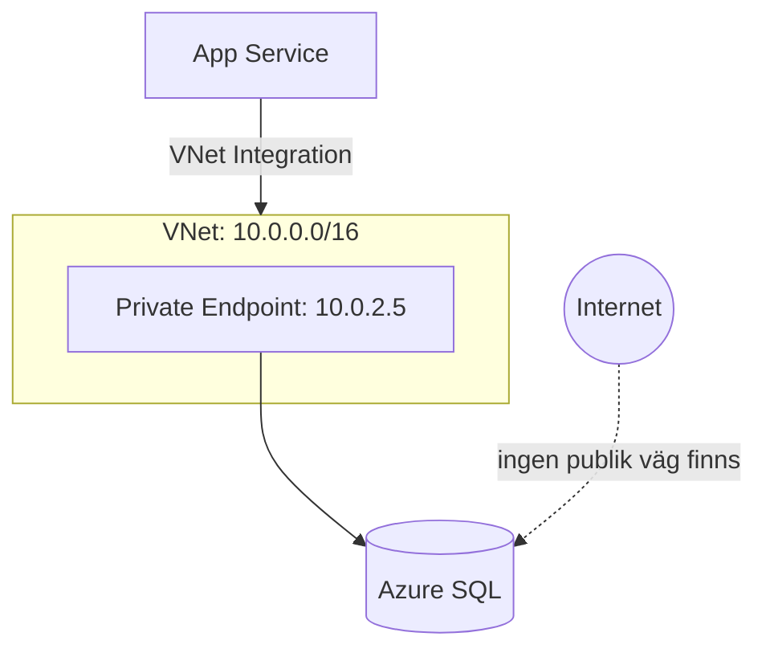
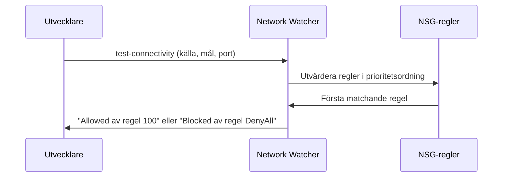

# Private Endpoints och Network Watcher

> Läsmaterial för lektion 3, vecka 35. Läs efter tisdagens tredje pass.

---

## Private Endpoints — det moderna sättet

Istället för att öppna portar i en NSG mot internet och lita på brandväggsregler, kan en Azure-tjänst (SQL, Storage, Key Vault) få en **privat IP-adress** direkt i ert VNet via en Private Endpoint.



Databasen är inte ens synlig från internet - inte blockerad, utan existerande enbart privat. Det är skillnaden mellan ett lås på en dörr och en vägg utan dörr alls.

---

## Service Endpoints vs Private Endpoints

**Service Endpoint** låter trafik från ert subnet nå Azure-tjänsten via Azures interna backbone-nätverk istället för publikt internet. Tjänsten har dock fortfarande en publik endpoint - åtkomsten begränsas bara till specifika subnets.

**Private Endpoint** ger tjänsten en helt privat IP-adress i VNet:et. Det finns ingen publik endpoint att nå överhuvudtaget.

| | Service Endpoint | Private Endpoint |
|--|------------------|-------------------|
| Publik endpoint kvar? | Ja, men begränsad | Nej |
| Trafikväg | Azure backbone | Helt privat IP |
| Rekommenderas för | Befintliga miljöer | Ny infrastruktur |

För ny infrastruktur är Private Endpoints förstahandsvalet - mer säkert och mer isolerat. Service Endpoints är en äldre lösning som fortfarande finns i många befintliga miljöer.

---

## NSG-debugging med Network Watcher

När NSG-regler orsakar oväntade problem (appen kan plötsligt inte nå databasen) är gissningsdebugging tidsödande. Network Watcher ger ett direkt svar:

```bash
az network watcher test-connectivity \
  --source-resource [vm-id] \
  --dest-address 10.0.2.5 \
  --dest-port 1433 \
  --resource-group rg-projekt
```



Network Watchers IP Flow Verify tar käll-IP, mål-IP, port och protokoll, och svarar exakt vilken regel som avgjorde utfallet. Det sparar betydande tid jämfört med att manuellt gå igenom regeluppsättningen.

---

## Vad du tar med dig

Private Endpoints är standardvalet för ny infrastruktur - de eliminerar den publika attackytan helt istället för att bara begränsa den. När något ändå går fel i nätverkskonfigurationen, är Network Watcher ett snabbare verktyg än att manuellt läsa igenom regellistan.
