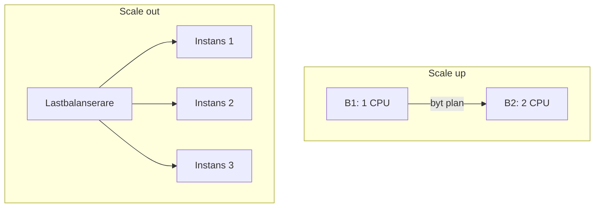

# Scale up/out och Azure Functions

> Läsmaterial för lektion 3, vecka 34. Läs efter tisdagens tredje pass.

Att skala en tjänst kan göras på två fundamentalt olika sätt, och Functions är en tjänstemodell som skalar annorlunda än båda.

---

## Scale up vs scale out

**Scale up** innebär att byta till en kraftfullare plan - till exempel från B1 till B2 till P1v3. Mer CPU och RAM per instans. Tar sekunder att genomföra, men kostar mer per timme.

**Scale out** innebär att lägga till fler instanser av samma plan. Mer parallell kapacitet, med lastbalansering inbyggd.

```bash
az appservice plan update \
  --name plan-projekt \
  --resource-group rg-projekt \
  --number-of-workers 3
```



Autoscale automatiserar scale out baserat på regler - till exempel CPU-belastning, kölängd i en meddelandekö, eller ett fast schema (fler instanser klockan 08-17, färre nattetid).

---

## Functions — mer än bara ett billigare alternativ

Serverless är inte bara en prismodell, det är en annan programmeringsmodell.

En Function har **ingen state** mellan körningar - varje exekvering är isolerad och vet ingenting om föregående körning.

**Cold start** innebär att om funktionen inte körts på ett tag tar första körningen längre tid, eftersom Azure måste allokera resurser innan koden kan börja exekvera.

**Timeout** är som standard 5 minuter, med ett max på 60 minuter på Consumption-planen.

### När passar Functions?

- Händelsedriven logik (t.ex. en blob laddas upp → en funktion triggas för att processa den)
- Sällan körda jobb (t.ex. nattlig städning av gamla poster)
- Enkla API-endpoints med låg och sporadisk trafik

### När passar Functions dåligt?

- Long-running processer som överskrider timeout-gränsen
- Appar som kräver state eller sessioner mellan anrop

---

## Tillbaka till Svarta fredagen

Betalnings-API:t från lektion 1 - passar det Functions?

Sannolikt inte som huvudlösning: betalningsflöden involverar ofta transaktionshantering som gynnas av state, och cold start är en risk när en kund väntar på ett kortsvar i realtid. App Service med autoscale är oftast ett säkrare val för den typen av kritiskt, tidskänsligt flöde.

---

## Vad du tar med dig

Scale up och scale out är två olika verktyg för samma mål (mer kapacitet) - välj baserat på om ni behöver mer kraft per instans eller fler parallella instanser. Functions är kraftfullt för rätt arbetsuppgift, men fel val för allt som kräver state eller garanterat snabb första respons.
