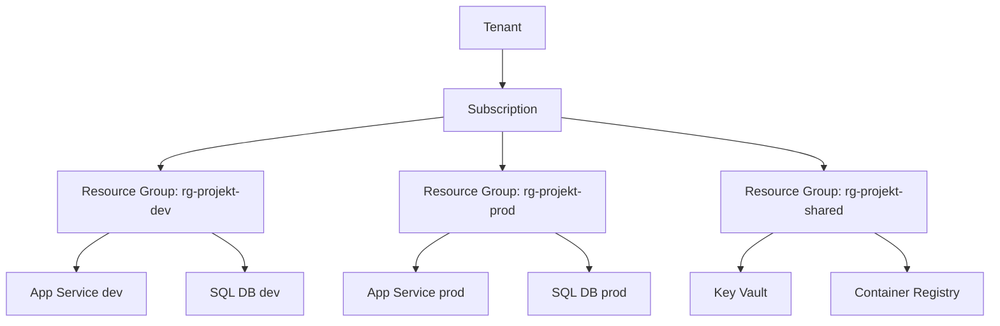

# Azure-hierarkin — ett verktyg, inte ett diagram

> Läsmaterial för lektion 2, vecka 33. Läs efter tisdagens andra pass.

Ni känner redan till strukturen:

```
Tenant → Subscription → Resource Group → Resurser
```

Det här materialet handlar om vad varje nivå faktiskt *gör* för er — inte bara vad den heter.

---

## Tenant

Din organisations utrymme i Azure Active Directory (Entra ID). Alla användare, grupper och behörigheter lever här. En tenant kan ha flera subscriptions under sig.

## Subscription

Faktureringsgräns. Alla kostnader inom en subscription samlas på ett ställe. Det är också en teknisk gräns — det finns kvoter per subscription (antal VM-kärnor, storage accounts, och så vidare).

## Resource Group — där det blir praktiskt viktigt

En resource group är tre saker på en gång:

**Livscykelenhet.** Allt som skapas inuti gruppen hör ihop. När du tar bort gruppen försvinner allt inuti — utan separat bekräftelse per resurs. Det är antingen ett kraftfullt verktyg (städa en hel dev-miljö med ett kommando) eller en katastrof (ta bort fel grupp i produktion).

**Åtkomstenhet.** RBAC-roller (vem som får göra vad) sätts på resource group-nivå. En junior utvecklare kan få Contributor i dev-gruppen men Reader i prod-gruppen.

**Kostnadsvisningsenhet.** Cost Analysis i Azure Portal visar kostnad per resource group. Utan den uppdelningen ser ni bara en total summa — och vet inte vad som kostar vad.



---

## Hur proffs strukturerar resource groups

Nybörjarmisstaget är en enda grupp för allt:

```
rg-allt
```

Problemet blir tydligt första gången någon behöver ta bort dev-miljön och av misstag raderar hela subscriptionens innehåll — inklusive produktion.

Den robusta strukturen är en grupp per miljö, plus en grupp för det som delas:

```
rg-[projekt]-dev
rg-[projekt]-staging
rg-[projekt]-prod
rg-[projekt]-shared     ← Key Vault, Container Registry, Log Analytics
```

Varför en egen `shared`-grupp? Key Vault och Container Registry används av både dev, staging och prod — de hör inte hemma i någon enskild miljös livscykel. Om ni tar bort `rg-projekt-dev` ska Container Registry fortfarande finnas kvar.

```bash
az group create --name rg-projekt-dev --location swedencentral
az group create --name rg-projekt-prod --location swedencentral
az group create --name rg-projekt-shared --location swedencentral
```

---

## Vad du tar med dig

Resource groups är inte en organisatorisk detalj — de är en säkerhetsgräns, en kostnadsrapport och en livscykelbrytare, samtidigt. En genomtänkt struktur förhindrar precis den typen av misstag som kostade 50 000 kronor i förra lektionen.
