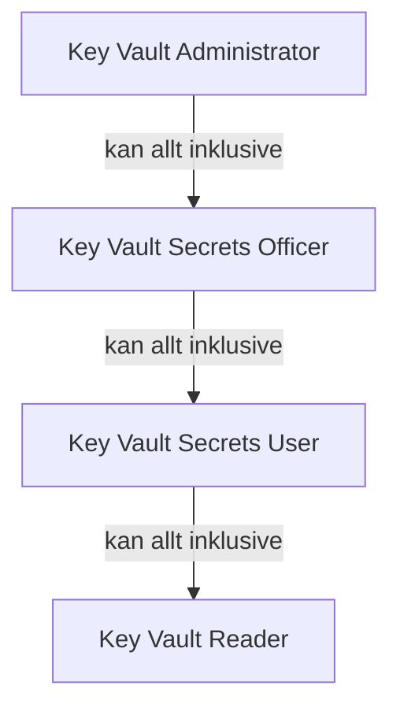

# Key Vault och RBAC

> Läsmaterial för lektion 5, vecka 35. Läs efter torsdagens andra pass.

Key Vault är Azures centrala tjänst för att lagra hemligheter säkert - men vad som faktiskt lagras där, och vem som får läsa det, är två separata frågor.

---

## Vad som lagras i Key Vault

| Typ | Exempel | Rotera hur ofta |
|-----|---------|-----------------|
| **Secret** | Connection string, API-nyckel | Vid misstänkt läcka / varje kvartal |
| **Key** | Krypteringsnyckel för databas | Automatisk rotation möjlig |
| **Certificate** | TLS-certifikat | Azure hanterar förnyelse |

Key Vault håller versionshistorik över alla ändringar. Roterar ni en secret finns den gamla versionen fortfarande kvar (men kan inaktiveras om den inte längre ska vara giltig). Att sätta en expiry date på secrets minskar risken att glömma rotation helt.

---

## RBAC på Key Vault

| Roll | Kan göra |
|------|---------|
| **Key Vault Administrator** | Allt, inklusive hantera åtkomstpolicyer |
| **Key Vault Secrets Officer** | Hantera secrets (skapa, uppdatera, ta bort) |
| **Key Vault Secrets User** | Läsa secrets - det appar normalt behöver |
| **Key Vault Reader** | Se metadata, inte de faktiska värdena |

---

## Principen om minsta behörighet, igen

En app ska ha rollen **Key Vault Secrets User** - inte Administrator. Det är samma "principle of least privilege" som gäller RBAC på resource groups sedan vecka 33.

Om en apps identitet skulle komprometteras med bara Secrets User-rollen, kan angriparen läsa secrets - men inte skapa nya, radera befintliga, eller ändra åtkomstpolicyer. Med Administrator-rollen skulle skadan vara betydligt större.

---

## Vad du tar med dig

Key Vault löser lagringsproblemet för hemligheter, men RBAC-rollen ni väljer avgör hur stor skadan blir om något ändå går fel. Applikationer ska nästan alltid ha den snävast möjliga rollen som fortfarande låter dem göra sitt jobb.
