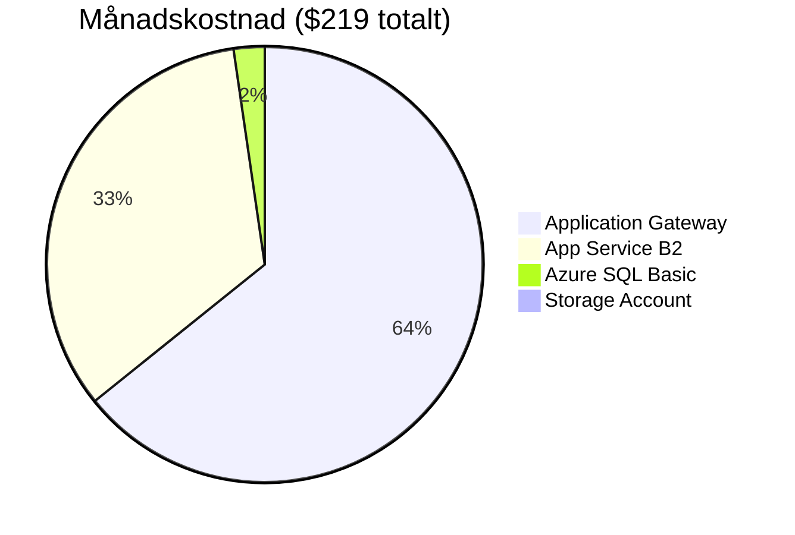

# Kostnadsmedvetenhet — molnet är inte gratis

> Läsmaterial för lektion 1, vecka 33. Läs efter tisdagens första pass.

Ni vet redan vad molnet är. Det här materialet handlar om något ni kanske inte tänkt lika mycket på: **att molnet fakturerar er för existens, inte bara för användning.**

---

## Skillnaden mellan "det fungerar" och "det är bra skött"

En app som fungerar är inte samma sak som en app som är bra skött.

Dåligt skött cloud-arbete:
- Appen fungerar
- Kostnaderna växer okontrollerat
- Ingen vet varför fakturan ser ut som den gör

Bra skött cloud-arbete:
- Appen fungerar
- Kostnaderna är förutsägbara
- Miljön går att återskapa från scratch på en timme

Det första är vad nybörjare bygger. Det andra är vad ni ska lära er.

---

## En verklig kostnadssmäll

En studerande satte upp ett Kubernetes-kluster för ett labbprojekt och glömde ta ner det över en helg.

**Resultat: 50 000 kronor på två dagar.**

Ingenting stoppade det automatiskt. Azure skickade ingen varning i tid. Fakturan kom, och den var verklig.

Det är den viktigaste läxan i hela lektionen: **Azure litar på att ni vet vad ni gör.** Det finns inga skyddsräcken som standard.

---

## Pay-as-you-go debiterar existens, inte bara trafik

Det är en vanlig missuppfattning att molnet fungerar som en taxameter — du betalar bara när något faktiskt används.

Det stämmer delvis. Men en App Service-plan (eller en VM, eller ett Kubernetes-kluster) kostar **per timme den existerar** — oavsett om den hanterar en miljon requests eller noll.

```
Måndag 08:00  → App Service B2 skapas
Fredag 17:00  → Sista deploy för veckan
Fredag 17:01 – Måndag 08:00 → Ingen trafik, men fakturan tickar ändå
```

En dev-miljö som lämnas igång över en helg utan trafik kostar exakt lika mycket som om den vore i full produktion.

---

## Vad kostar det egentligen?

Ett typiskt litet setup i North Europe:

| Resurs | Kostnad/mån |
|--------|-------------|
| App Service B2 | ~$73 |
| Azure SQL Basic | ~$5 |
| Storage Account (100 GB, cool tier) | ~$1 |
| Application Gateway (liten) | ~$140 |
| **Totalt** | **~$219** |

Lägg märke till vilken rad som dominerar: **Application Gateway**, inte App Service. Lastbalanserare och gateway-tjänster är notoriskt dyra jämfört med vad man intuitivt förväntar sig — och de är den rad som oftast glöms bort i en snabb budgetskiss.



---

## Vad du tar med dig

Molnet är billigare än att äga egna servrar — **men bara om ni vet vad ni gör.** Att veta vad ni gör börjar med att veta vad varje resurs kostar, och att aldrig lämna något igång "för säkerhets skull".

Nästa lektion i den här kedjan (budget och alerts) ger er verktygen för att faktiskt skydda er mot en till 50 000-kronorssmäll.
