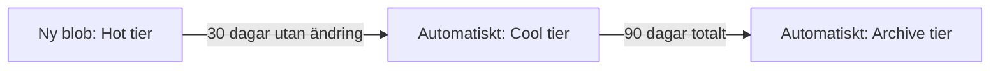
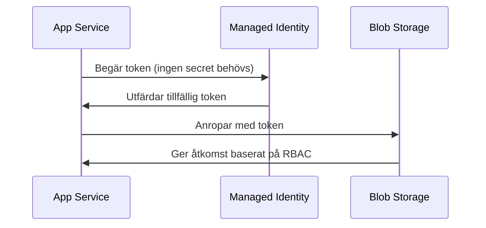

# Lifecycle policy och Managed Identity

> Läsmaterial för lektion 5, vecka 34. Läs efter torsdagens andra pass.

Två separata ämnen som delar samma underliggande princip: bygg in skyddet från början, inte som en efterhandskonstruktion.

---

## Lifecycle policy — automatisera tiering

En lifecycle policy flyttar automatiskt blobar mellan tiers baserat på ålder, istället för att någon manuellt behöver göra det.

```json
{
  "rules": [{
    "name": "auto-tier",
    "type": "Lifecycle",
    "definition": {
      "filters": { "blobTypes": ["blockBlob"] },
      "actions": {
        "baseBlob": {
          "tierToCool":    { "daysAfterModificationGreaterThan": 30 },
          "tierToArchive": { "daysAfterModificationGreaterThan": 90 }
        }
      }
    }
  }]
}
```



Sätt upp policyn när storage accountet skapas - samma logik som budget alerts i vecka 33: skydd i förväg är billigare än städning efter att fakturan redan rasat iväg.

---

## Managed Identity — aldrig en connection string i koden

Ett vanligt, farligt mönster är att hårdkoda en connection string direkt i koden eller i en konfigurationsfil som checkas in i Git:

```csharp
// Gör inte det här i produktion:
var client = new BlobServiceClient("DefaultEndpointsProtocol=https;AccountName=...");
```

Det korrekta mönstret använder `DefaultAzureCredential`, som fungerar både lokalt (via din egen Azure-inloggning) och i Azure (via en Managed Identity som är knuten till resursen):

```csharp
// Gör det här istället:
var client = new BlobServiceClient(
    new Uri("https://[account].blob.core.windows.net"),
    new DefaultAzureCredential());
```



Ingen connection string i koden. Ingen secret att rotera manuellt. Ingen läcka i git-historiken att oroa sig för. Vi sätter upp Managed Identity på riktigt, praktiskt, i vecka 35.

---

## Vad du tar med dig

Båda ämnena handlar om att flytta ansvar från "någon måste komma ihåg att göra det senare" till "systemet gör det automatiskt från början". Det är ett återkommande tema genom hela kursen: proaktivt skydd slår reaktiv städning.
