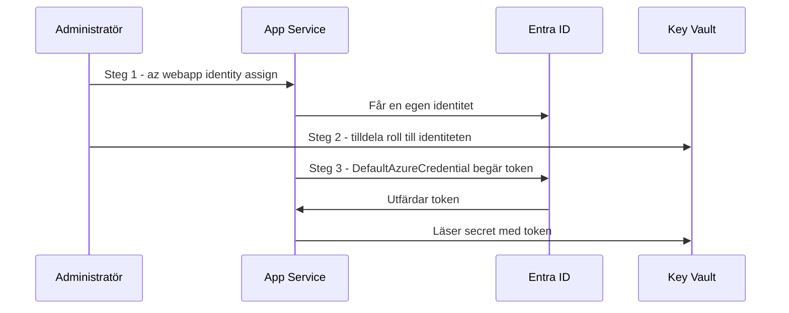

# Managed Identity på riktigt

> Läsmaterial för lektion 4, vecka 35. Läs efter torsdagens första pass.

I vecka 34 nämndes Managed Identity som konceptet bakom att slippa hårdkodade connection strings. Den här lektionen sätter upp det praktiskt, i tre steg.

---

## Steg 1: Aktivera Managed Identity på resursen

```bash
az webapp identity assign \
  --name min-app \
  --resource-group rg-projekt
```

Det här ger App Service en egen identitet i Microsoft Entra ID - separat från er egen användaridentitet.

---

## Steg 2: Ge identiteten rätt roll

```bash
az role assignment create \
  --assignee [principal-id] \
  --role "Key Vault Secrets User" \
  --scope [vault-id]
```

En identitet utan roll kan inte göra något. RBAC-principen från vecka 33 gäller även här - identiteten måste explicit tilldelas rätt behörighet på rätt resurs.

---

## Steg 3: Koden

```csharp
var client = new SecretClient(
    new Uri("https://[vault-name].vault.azure.net"),
    new DefaultAzureCredential());
```

`DefaultAzureCredential` känner automatiskt av att koden körs i Azure och använder resursens Managed Identity för autentisering - ingen ytterligare konfiguration krävs i koden själv.



---

## Vad du tar med dig

Managed Identity är inte komplicerat - det är tre konkreta, upprepningsbara steg. Det vanligaste misstaget är att glömma steg 2 (rätt roll): identiteten finns, men saknar behörighet, vilket ger ett förvirrande åtkomstfel som lätt misstolkas som ett kodfel.
