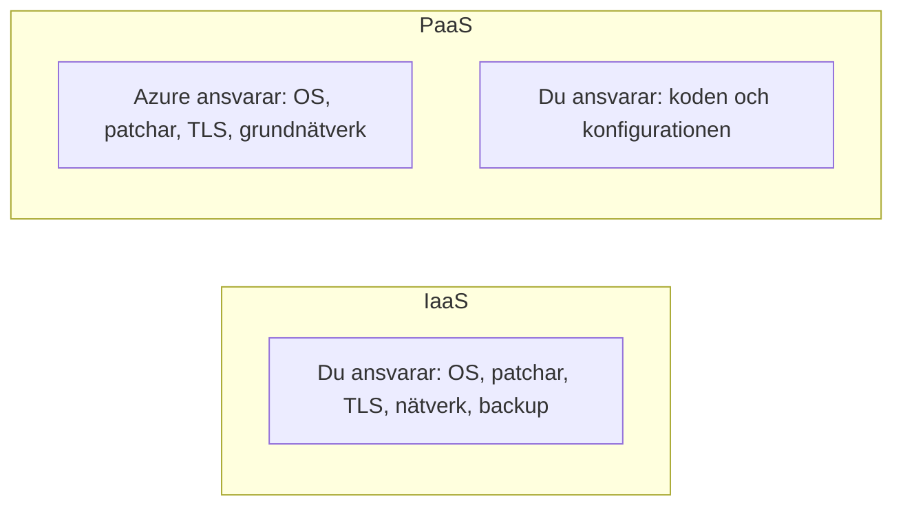

# Molnmodeller och IaaS vs PaaS — beslut, inte kategorier

> Läsmaterial för lektion 3, vecka 33. Läs efter tisdagens tredje pass.

Ni känner redan till skillnaden mellan publikt, privat och hybrid moln, och mellan IaaS, PaaS och SaaS. Det här materialet handlar om att använda de begreppen för att fatta beslut — inte bara känna igen dem på en tenta.

---

## Tre molnmodeller

**Publikt moln** (Azure, AWS, GCP): Snabbt att komma igång, kostnadseffektivt i liten skala, elastiskt. Ni delar fysisk infrastruktur med andra kunder, isolerat via virtualisering.

**Privat moln**: Er egen infrastruktur, men med molnteknik ovanpå (t.ex. Azure Stack). Full kontroll över hårdvara och placering, men ni bär hela kostnaden och driftsansvaret själva.

**Hybrid moln**: En medveten kombination — känslig data eller reglerad verksamhet stannar i egen infrastruktur, medan allt annat (webbfrontend, burst-kapacitet, utveckling) körs i det publika molnet.

### Exempel: banken

En bank med regulatoriska krav på data-residency (kunddata får inte lämna landet) men som samtidigt behöver kunna skala upp snabbt vid hög belastning (till exempel kring månadsskiften) är ett typexempel på hybrid. Det är inte ett filosofiskt val om vad som är "bäst" — det är ett svar på ett konkret affärs- och regelkrav.

---

## IaaS vs PaaS — ansvarsfrågan

Den tekniska skillnaden mellan IaaS och PaaS är bekant. Den operativa frågan är viktigare:

> Vill jag äga ansvaret för OS-patchar, TLS-certifikat och nätverkskonfiguration — eller vill jag att Azure ska sköta det åt mig?

Med **IaaS** (till exempel en Virtual Machine) ansvarar ni för:
- OS-uppdateringar och säkerhetspatchar
- TLS-certifikat och förnyelse
- Nätverkskonfiguration och brandväggsregler
- Backup och recovery

Med **PaaS** (till exempel App Service) sköter Azure:
- OS-patchar
- TLS-certifikat (med managed certificates)
- Grundläggande nätverkssäkerhet
- Inbyggd backup-funktion

Startups och konsultprojekt väljer nästan alltid PaaS — inte för att de inte kan hantera IaaS, utan för att det inte är ett effektivt sätt att lägga sin begränsade tid. Legacy-migrationer och vissa regulatoriska krav är situationer där IaaS ändå blir nödvändigt.

---

## Tillbaka till startup-frågan

I lektion 1 fick ni frågan: en startup med 3 utvecklare, $500/mån i budget, 6 veckor till lansering — vilken Azure-tjänst?

**Svaret: App Service (PaaS).**

Motivationen är det som faktiskt räknas:
- **$500/mån** → utesluter dyra komponenter som Application Gateway eller en premium-plan
- **6 veckor** → ingen tid att konfigurera och testa VM-infrastruktur från grunden
- **3 utvecklare** → ingen i teamet som har tid att hantera OS-patchar vid sidan av produktutveckling

Arkitekturbeslut är nästan alltid avvägningar mellan kontroll, kostnad och tid — sällan ett objektivt "rätt svar" oavsett kontext.

---

## Vad du tar med dig

Molnmodell och servicemodell (IaaS/PaaS/SaaS) är inte kunskap att kunna utantill — de är ett ramverk för att motivera ett beslut. Nästa gång ni väljer arkitektur, ställ er själva samma fråga som i den här lektionen: vad kostar det, hur mycket tid har vi, och vem bär ansvaret om något går sönder?
