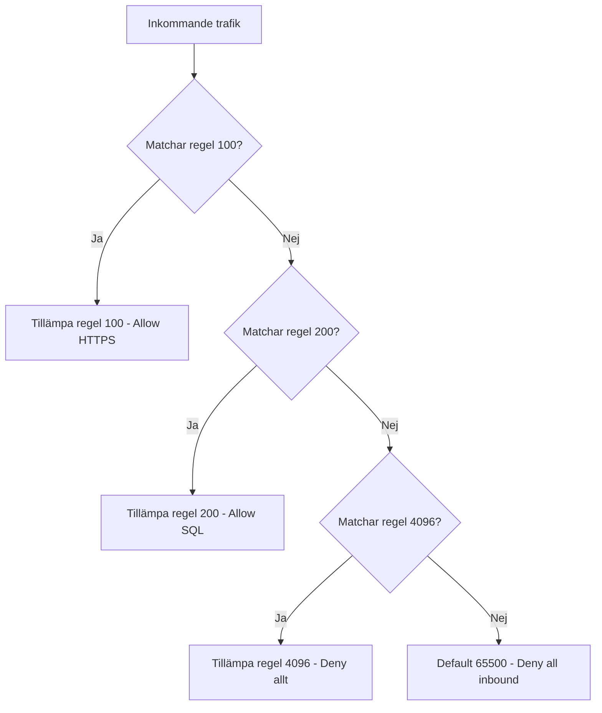

# NSG och prioritetsordning

> Läsmaterial för lektion 2, vecka 35. Läs efter tisdagens andra pass.

Network Security Groups (NSG) filtrerar trafik in och ut ur ett subnet eller en nätverkskortsanslutning. Reglerna i sig är enkla - det som är lätt att missa är hur ordningen mellan dem avgör resultatet.

---

## Prioritetsordningen

```
Regel 100: Allow HTTPS från Internet
Regel 200: Allow SQL från frontend-subnet
Regel 4096: Deny allt

Azure default 65500: Deny all inbound
```

Lägre prioritetsnummer betyder högre prioritet - Azure utvärderar reglerna i nummerordning och stannar vid **första matchande regel**.



---

## Tre vanliga misstag

**Glömmer att koppla NSG till subnettet.** En NSG kan finnas skapad i Azure utan att faktiskt vara kopplad till det subnet man tror den skyddar - reglerna gäller då ingenting.

**Sätter en Deny-regel på ett högre nummer än en Allow-regel för samma trafik.** Eftersom Azure stannar vid första matchande regel, blir Allow-regeln aldrig aktuell om en Deny-regel med lägre nummer redan matchat samma trafik.

**Öppnar port 22 (SSH) mot Internet "tillfälligt".** Det tillfälliga blir ofta permanent - en glömd, öppen SSH-port mot internet är en av de vanligaste verkliga säkerhetsincidenterna i molnmiljöer.

---

## Ett konkret exempel

Tre regler: Allow SSH (prioritet 100), Deny allt från Internet (prioritet 150), Allow HTTPS (prioritet 200).

HTTPS-trafik nekas - trots att en Allow-regel för HTTPS finns - eftersom Deny-regeln (150) har lägre prioritetsnummer och matchar trafiken innan Allow-regeln (200) ens utvärderas.

---

## Vad du tar med dig

En NSG-regel är aldrig bara "rätt" eller "fel" i isolering - dess effekt beror helt på var i prioritetsordningen den ligger relativt andra regler. Läs alltid hela regeluppsättningen i nummerordning innan ni drar slutsatser om vad som faktiskt tillåts eller nekas.
