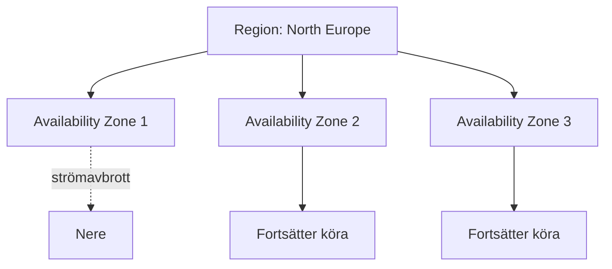

# Regioner och Availability Zones — mer än geografi

> Läsmaterial för lektion 5, vecka 33. Läs efter torsdagens andra pass.

Att välja Azure-region känns ofta som att välja "det som ligger närmast". Det är sällan hela bilden.

---

## Regioner — tre exempel

- **North Europe** (Irland)
- **West Europe** (Nederländerna)
- **Sweden Central** (Gävle)

### Varför Sweden Central för en svensk kund?

- **GDPR** — data stannar fysiskt i Sverige
- **Latens** — lägre svarstider för svenska slutanvändare
- **Compliance** — vissa avtal eller branschregler kräver det explicit

### Varför INTE alltid Sweden Central?

- Ofta dyrare än äldre regioner
- Färre tillgängliga tjänster (nyare region, mindre utbyggd)
- **Saknar (ännu) availability zones**

Den sista punkten är avgörande för nästa avsnitt.

---

## Availability zones — för det som inte får gå ner

En **region** är ett kluster av datacenter i ett geografiskt område. En **availability zone (AZ)** är ett fysiskt separerat datacenter inom den regionen — med egen ström, kylning och nätverksanslutning.

Om ett datacenter i AZ1 drabbas av ett strömavbrott, fortsätter AZ2 och AZ3 att fungera opåverkat.

### Vad krävs för att dra nytta av det?

Zone-redundans är inget som händer automatiskt — ni måste aktivt välja tjänster och planer som stödjer det:

- App Service **Premium v3** (zone-redundant)
- Azure SQL med **geo-replikering**
- **Zone-redundant storage (ZRS)**

Det kostar mer per månad. För kritiska produktionssystem är det värt det. För ett internt utvecklingsverktyg är det ofta onödig kostnad.

---

## Avvägningen: Sweden Central vs North Europe

En kund med finansiell data i Sverige ställer er inför ett dilemma:

| Argument för Sweden Central | Argument mot |
|---|---|
| Data stannar i Sverige (GDPR/compliance) | Inga availability zones ännu |
| Lägre latens för svenska slutanvändare | Dyrare, färre tjänster |

Det finns inget objektivt rätt svar. Om regelverket kräver svensk lagring och systemet tål viss risk för nedtid, blir Sweden Central rätt val. Om hög tillgänglighet är kritiskt och regelverket tillåter EU-lagring generellt, kan North Europe med zone-redundans vara det bättre valet.

---

## Vad du tar med dig

Regionval är en avvägning mellan efterlevnad, latens, kostnad och tillgänglighet — inte ett automatiskt val av "det som ligger närmast". Och inte alla system behöver zone-redundans: att betala extra för hög tillgänglighet på ett system där nedtid är acceptabelt är slöseri, inte god praxis.
