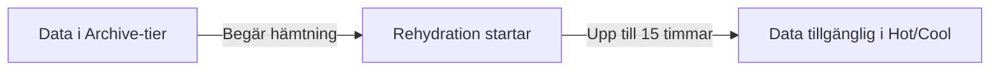

# Blob Storage — vad det faktiskt kostar

> Läsmaterial för lektion 4, vecka 34. Läs efter torsdagens första pass.

Ni vet redan vad hot, cool och archive tiers är. Det här materialet handlar om vad som faktiskt kostar pengar i verkligheten - inte bara i teorin.

---

## Egress - samma princip, ny tjänst

Att hämta data ut från Azure (egress) kostar pengar. Att ladda upp data är gratis. Det är samma asymmetri ni lärde er om i vecka 33, bara applicerad på Blob Storage specifikt.

En app som serverar bilder direkt från en Blob Storage-container betalar för varje enskild hämtning - vilket kan bli en betydande kostnad för en tjänst med hög trafik.

---

## Archive-tier: rehydration

Att hämta (läsa) data som ligger i Archive-tier kräver en process som kallas **rehydration**, och den kan ta upp till 15 timmar på standardnivå.

Planera aldrig Archive-data för något som behöver svar snabbt - en kund som ringer och vill ha sin årsrapport just nu kan inte vänta 15 timmar.

---

## LRS vs GRS

**LRS** (Locally Redundant Storage) replikerar data inom samma datacenter. Billigast av redundansalternativen.

**GRS** (Geo-Redundant Storage) replikerar data till en annan Azure-region. Kostar ungefär dubbelt så mycket, men skyddar mot att en hel region blir otillgänglig.

Valet mellan dem handlar om vad det kostar er att förlora datan permanent - inte bara vad det kostar att lagra den.

| | LRS | GRS |
|--|-----|-----|
| Replikering | Inom datacenter | Till annan region |
| Kostnad | Lägre | Cirka dubbelt |
| Skydd mot | Diskfel | Hel regions bortfall |

---

## Vad du tar med dig

Tre datatyper med olika kostnadsprofil kräver tre olika beslut: hot tier för data som läses ofta, cool eller archive för data som sällan öppnas, och redundansval (LRS/GRS) baserat på hur allvarligt det vore att förlora datan permanent. En genomtänkt strategi här kan skilja en rimlig faktura från en chockerande en.
