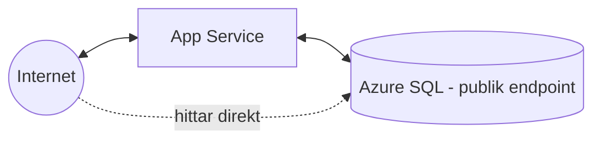
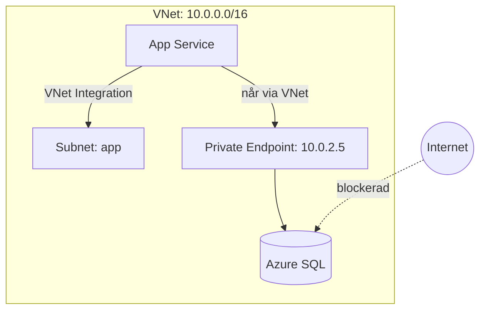

# Hotbilden och VNet Integration

> Läsmaterial för lektion 1, vecka 35. Läs efter tisdagens första pass.

Ni vet redan att data ska isoleras och att credentials inte ska ligga hårdkodade i koden. Den här veckan handlar om att faktiskt sätta upp det skyddet.

---

## Vad som faktiskt gick fel

Ett vanligt nybörjarmisstag ser ut så här:

Databasen har en publik endpoint, och connection string ligger hårdkodad i `appsettings.json`. Appen fungerar perfekt - tills någon hittar databasens publika adress och försöker logga in mot den direkt.

Målet för den här veckan: ingen publik åtkomst till databas eller interna tjänster, och inga credentials i koden överhuvudtaget.

---

## App Service lever utanför ert VNet som standard

Det här är en viktig, ofta förbisedd detalj: en App Service är från start inte en del av ert virtuella nätverk. Den når internet fritt, och internet når den fritt (om inget annat konfigureras).

Det finns två separata mekanismer för de två riktningarna:

**VNet Integration** löser utgående trafik - att appen ska kunna nå resurser inuti VNet:et (som en databas med en privat endpoint).

**Private Endpoint** löser inkommande trafik till en resurs - att en tjänst (som appen själv, eller en databas) får en privat IP-adress i VNet:et istället för en publik.

---

## Vad du tar med dig

VNet Integration och Private Endpoint löser två olika, kompletterande problem: den ena låter appen nå in i det skyddade nätverket, den andra gör en resurs osynlig för omvärlden. De flesta säkra arkitekturer i Azure använder båda samtidigt.
